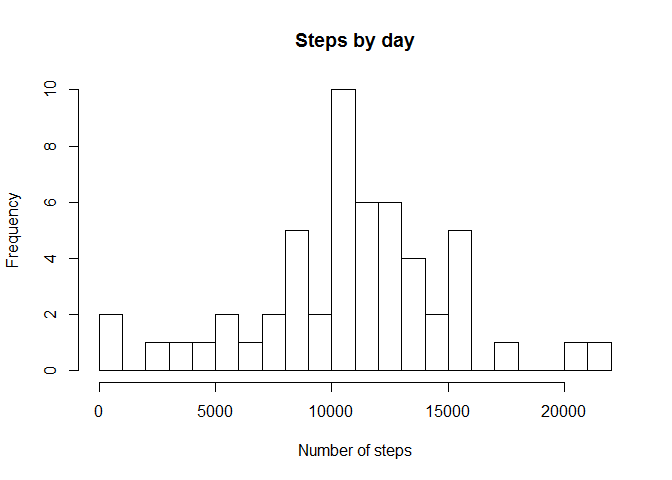
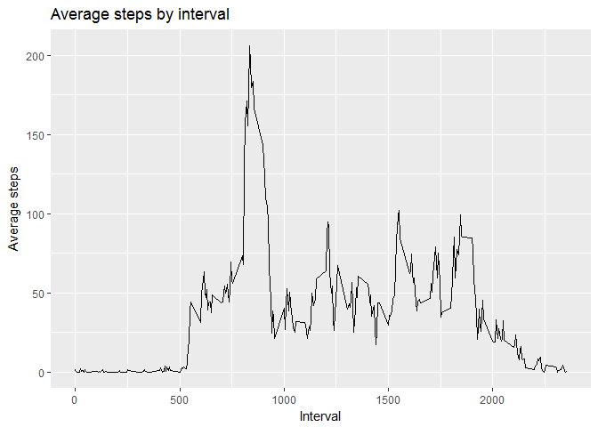
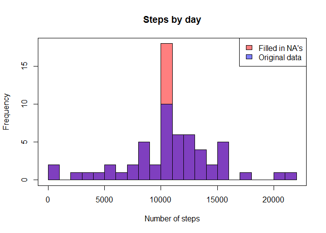
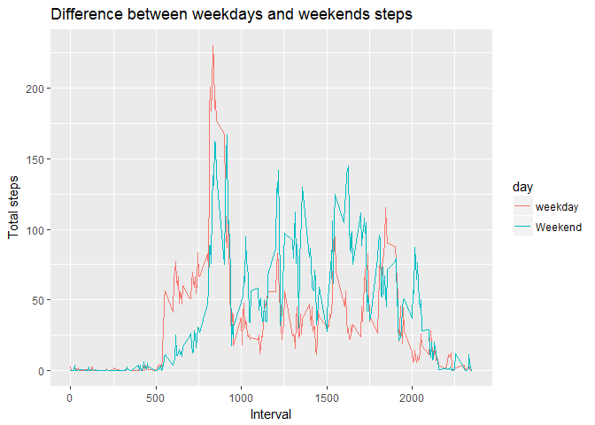

### First the necessary libraries are loaded

```r
library(data.table)
library(ggplot2)
```

## Loading and preprocessing the data

1. Load the data

```r
unzip("./activity.zip")
activity <- fread("./activity.csv")
```

2. Process/transform the data (if necessary) into a format suitable for your analysis


```r
Sys.setlocale("LC_ALL","English")
activity$date <- as.Date(activity$date)
```

## What is mean total number of steps taken per day?

1. Calculate the total number of steps taken per day


```r
stepsByDay <- aggregate(steps ~ date, activity, sum, na.rm = TRUE)
```

2. Make a histogram of the total number of steps taken each day


```r
hist(stepsByDay$steps, breaks = 20, main = "Steps by day", xlab = "Number of steps")
```

<!-- -->

3. Calculate and report the mean and median of the total number of steps taken per day


```r
mean(stepsByDay$steps, na.rm = TRUE)
```

```
## [1] 10766.19
```

```r
median(stepsByDay$steps, na.rm = TRUE)
```

```
## [1] 10765
```

## What is the average daily activity pattern?

1. Make a time series plot of the 5-minute interval (x-axis) and the average number of steps taken, averaged across all days (y-axis)


```r
stepsByInterval <- aggregate(steps ~ interval, activity, mean, na.rn = TRUE)
g <- ggplot(stepsByInterval, aes(interval, steps))
g + geom_line() + ggtitle("Average steps by interval") + xlab("Interval") + ylab("Average steps")
```

<!-- -->

2. Which 5-minute interval, on average across all the days in the dataset, contains the maximum number of steps?


```r
stepsByInterval[which.max(stepsByInterval$steps),]
```

```
##     interval    steps
## 104      835 206.1698
```


## Imputing missing values

1. Calculate and report the total number of missing values in the dataset 


```r
sum(is.na(activity$steps))
```

```
## [1] 2304
```

2. Devise a strategy for filling in all of the missing values in the dataset.

 - We calculate the mean of every interval and we will assign the value of the interval mean, to the interval that has a NA as value.

3. Create a new dataset that is equal to the original dataset but with the missing data filled in.


```r
activity.complete <- activity
activity.complete$isNa <- is.na(activity$steps)
mean.stepsByInterval <- aggregate(steps ~ interval, activity, mean, na.rn = TRUE)
activity.complete$steps <- ifelse(activity.complete$isNa, mean.stepsByInterval$steps, activity.complete$steps)
activity.complete$isNa <- NULL
```

4. Make a histogram of the total number of steps taken each day and Calculate and report the mean and median total number of steps taken per day. Do these values differ from the estimates from the first part of the assignment? What is the impact of imputing missing data on the estimates of the total daily number of steps?


```r
stepsByDay.complete <- aggregate(steps ~ date, activity.complete, sum, na.rm = TRUE)
hist(stepsByDay.complete$steps, breaks = 20, main = "Steps by day", xlab = "Number of steps", col=rgb(1,0,0,0.5))
par(new=TRUE)
hist(stepsByDay$steps, breaks = 20, main = "Steps by day", xlab = "Number of steps", add=T,  col=rgb(0,0,1,0.5, 0.5))
box()
legend("topright", c("Filled in NA's", "Original data"), fill=c(rgb(1,0,0,0.5), rgb(0,0,1,0.5, 0.5)))
```

<!-- -->


```r
mean(stepsByDay.complete$steps, na.rm = TRUE)
```

```
## [1] 10766.19
```

```r
median(stepsByDay.complete$steps, na.rm = TRUE)
```

```
## [1] 10766.19
```

We can see that the data is more "normalized" and the mean and the median are equals now.

## Are there differences in activity patterns between weekdays and weekends?

1. Create a new factor variable in the dataset with two levels - "weekday" and "weekend" indicating whether a given date is a weekday or weekend day.


```r
activity.complete$day <- ifelse(weekdays(activity.complete$date) %in% c("Saturday", "Sunday"), "Weekend", "weekday")
activity.complete$day <- factor(activity.complete$day)
```

2. Make a panel plot containing a time series plot (i.e. type = "l") of the 5-minute interval (x-axis) and the average number of steps taken, averaged across all weekday days or weekend days (y-axis).


```r
stepsByIntervalAndDay <- aggregate(activity.complete$steps, by=list(interval=activity.complete$interval, day=activity.complete$day), FUN=mean)
g2 <- ggplot(stepsByIntervalAndDay, aes(interval, x))
g2 + geom_line(aes(color=day)) + xlab("Interval") + ylab("Total steps") + ggtitle("Difference between weekdays and weekends steps")
```

<!-- -->
